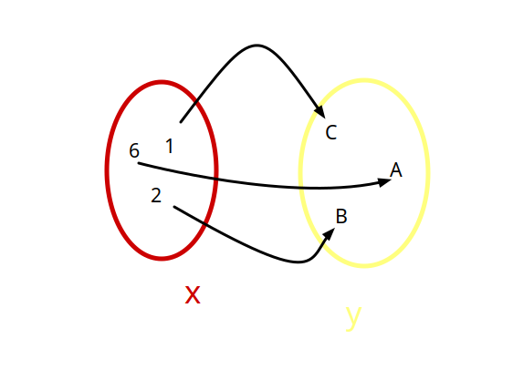
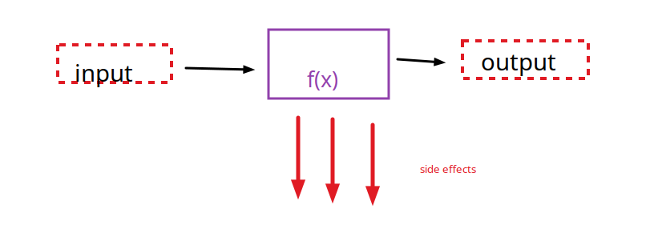

#   Paradigma funcional

---

> La programación funcional (PF) es un paradigma de programación al igual que la programación orientada a objetos (POO). La PF se basa en cálculo lambda y concretamente en composición de funciones puras para modelar las soluciones de software.'

---

## Historia 

-   1936 Alonzo chuch introduce el concepto de **Calculo Lambda**   
- 1960 se crea LISP
- 1978 se crea ML 
- 1990 Se estandariza un lenguaje funcional (Haskel)

---

## Caracteristicas principales

- Declarativo ( != Imperativo) enfocado en el **que** en lugar del como
    alto nivel,sin sentencias de control de flujo
- centrado en **funciones**
- Los programas se contruyen **componiendo y aplicando funciones**
- Basados en el concepto del **calculo Lambda**


---

## **7** Aspectos del paradigma funcional

- 1 - Programas como funciones 
- 2 - Funciones puras
- 3 - Datos inmutables 
- 4 - Funciones Primera clase
- 5 - Funciones de orden superior
- 6 - Composicion de funciones
- 7 - Recursividad (para iteracion)

### 1- Programas como funciones 

> El tipo principal son las **funciones**, escribimos funciones que interactuan entre si, llaman a otras, se componen se aplican etc


-  Un programa puramente funcional se compone mediante **aplicacion** y 
 **composicion** de funciones. 
- Un programa puede definirse como una lista de funciones. 
- Ejecutar un programa consiste en evaluar funciones siguiendo las bases establecidas por el calculo lambda.




### 2- Funciones puras

- X No usan datos fueras del ambito (scope) de la funcion
- No hay side effects (no pueden modificar un estado externo)
- Son deterministicas



``` scala
//side effect incrementa una variable fuera del ambito de la funcion, y utiliza datos fuera del scope
var total = 0;
def incrementar() = {
    total += 1;
}   

// funcion pura, no utiliza datos fuera del scope y no tiene side effects
var total = 0; 
def incrementar(x: Int) : Int = {
    return x+1;
}
```

### Beneficios de usar funciones puras <3

- Funciones cacheables
- Funciones paralelizables
- Faciles de testear
- Faciles de entender
- Faciles de combinar entre si

## 3- **Datos** inmutables

> Una vez creado el **dato** su valor no cambia, ojo! el dato
> no es la variable que apunta al dato, la variable si puede cambiar
> a menos que sea una val y no var

```scala 3
 val x:Int = 5;//valor inmutable, constante
 var y:Int = 3; //variable puede cambiar pero el valor inmutable
```

> Las funciones no cambian sus argumentos recibidos


### beneficios de usar datos inmutables
<3 - En la concurrencia, si muchos procesos estan trabajando con un dato
    lo mejor es que no cambien

<3 - matematica, es mas analogo a la mate que un valor de entrafa no cambie

---

## 4- Funciones primera clase

> En paradigmas funcionales, las funciones un tipo màs de primera clase
es decir las funciones se pueden asignar a variables, pasar como argumento de otras funciones
> ser el retorno de otra 

``` scala 3
  def cuadrado(x:Int):Int = return x*x;
  //ASIGNACION a var y val
  var cuadradoVar = cuadrado;
  val cuadradoVal = cuadrado;
  println(cuadradoVal(5));

  //Pasaje como argumento
  def multiply(x:Int,f:(Int)=>Int):Int = {
    return x*f(x);
  } //media rara, pero es para hacer sqr(x)*x= cube

  println(multiply(2,cuadrado));
}


```

### Beneficios de usar funciones primera clase (o que lo sean)

- ♥ - Permiten **generalizacion** al momento de aplicar funciones
- ♥ - Permiten tener funciones dentro de tipos de datos, por ejemplo en los hashs o algo asi
- ♥- Permiten introducir conceptos de paradigma funcional como puedne ser : evaluacion parcial
 curryng, composicion Y FOS


---

## Funciones de Orden Superior (FOS)

> Para que una funcion sea de orden superior debe cumplir alguna ( o ambas) de las siguientes 2 condiciones

> C1: Recibir una funcion como parametro

> C2: Retornar una funcion 


Ejemplo: 

```scala 3
//ejemplo, funcion que recorre una lista y filtra por una funcion de condicion

  def esPar(x:Int):Boolean = {
    return x%2==0;
  }
  val l:List[Int] = List(1,2,3,4,5,6,7,8,9,10,11,12,13,14);//lista original
    //ver pattern matching
  def filtrarLista(l:List[Int],f:(Int)=>Boolean) : List[Int] =l match {
    case Nil => List()
    case (xh::xt) if f(xh) => xh::filtrarLista(xt,f)
    case (xh::xt) => filtrarLista(xt,f)
  }
```

## Composicion de funciones 

Mecanismo  de combinar funciones simples para obtener otras màs cvocmplejas, similar al concepto
de composicion de funciones de la matematica

el resultado de una funcion se utiliza como argumento de otra

Ejemplo:
``` scala 3
def cuadrado(x:Int):Int = {
return x*x;
}
def diferenciaDeCuadrados(x:Int,y:Int):Int={
return cuadrado(x)-cuadrado(y);
}


o bien
val resta = (x:Int,y:Int) => x-y;
def diferenciaDeCuadrados(x:Int,y:Int):Int={
return resta(cuadrado(x),cuadrado(y));
}

```


## Recursividad
 
En paradigma funcional no hay, o no utilizamos, sentencias de control de flujo. Entonces
como iteramos??? con recursividad

> LembranÇa algoritmos II: algo recursivo es algo definido en terminos de si mismo, una funcion recursiva lo es
> cuando estas codificando una funcion recursiva te podes abstraer de la funcion que estas escribiendo


> Una funcion recursiva debe tener un caso base, o trivial que asegure la convergencia temporal
>es importante identificar la naturaleza o el aspecto recursivo de un problema, podemos hacerlo enunciando en voz alta
>el problema hasta que quede en evidencia o con la forma matematica si la tuviera

> Una funcion recursiva busca resolver un problema reduciendo la complejidad
> a  pequeños casos del mismo problema

> caso general: es la formula general bajada  al lenguaje de programacion, es el aspecto recursivo del problema

> caso base o trivial: en donde no tenes que pensar ni if ni nadaaaa


