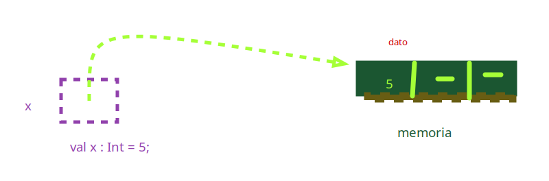

#   Paradigma funcional

---

> La programación funcional (PF) es un paradigma de programación al igual que la programación orientada a objetos (POO). La PF se basa en cálculo lambda y concretamente en composición de funciones puras para modelar las soluciones de software.'

---

## Historia 

-   1936 Alonzo chuch introduce el concepto de **Calculo Lambda**   
- 1960 se crea LISP
- 1978 se crea ML 
- 1990 Se estandariza un lenguaje funcional (Haskel)

---

## Caracteristicas principales

- Declarativo ( != Imperativo) enfocado en el **que** en lugar del como
    alto nivel,sin sentencias de control de flujo
- centrado en **funciones**
- Los programas se contruyen **componiendo y aplicando funciones**
- Basados en el concepto del **calculo Lambda**


---

## **7** Aspectos del paradigma funcional

- 1 - Programas como funciones 
- 2 - Funciones puras
- 3 - Datos inmutables 
- 4 - Funciones Primera clase
- 5 - Funciones de orden superior
- 6 - Composicion de funciones
- 7 - Recursividad (para iteracion)

### 1- Programas como funciones 

> El tipo principal son las **funciones**, escribimos funciones que interactuan entre si, llaman a otras, se componen se aplican etc


-  Un programa puramente funcional se compone mediante **aplicacion** y 
 **composicion** de funciones. 
- Un programa puede definirse como una lista de funciones. 
- Ejecutar un programa consiste en evaluar funciones siguiendo las bases establecidas por el calculo lambda.


### 2- Funciones puras

- X No usan datos fueras del ambito (scope) de la funcion
- No hay side effects (no pueden modificar un estado externo)
- Son deterministicas


``` scala
//side effect incrementa una variable fuera del ambito de la funcion, y utiliza datos fuera del scope
var total = 0;
def incrementar() = {
    total += 1;
}   

// funcion pura, no utiliza datos fuera del scope y no tiene side effects
var total = 0; 
def incrementar(x: Int) : Int = {
    return x+1;
}
```

### Beneficios de usar funciones puras <3

- Funciones cacheables
- Funciones paralelizables
- Faciles de testear
- Faciles de entender
- Faciles de combinar entre si

## 3- **Datos** inmutables

> Una vez creado el **dato** su valor no cambia, ojo! el dato
> no es la variable que apunta al dato, la variable si puede cambiar
> a menos que sea una val y no var

```scala 3
 val x:Int = 5;//valor inmutable, constante
 var y:Int = 3; //variable puede cambiar pero el valor inmutable
```

> Las funciones no cambian sus argumentos recibidos



### beneficios de usar datos inmutables
<3 - En la concurrencia, si muchos procesos estan trabajando con un dato
    lo mejor es que no cambien

<3 - matematica, es mas analogo a la mate que un valor de entrafa no cambie

---

## 4- Funciones primera clase

> En paradigmas funcionales, las funciones un tipo màs de primera clase
es decir las funciones se pueden asignar a variables, pasar como argumento de otras funciones
> ser el retorno de otra 

``` scala 3
  def cuadrado(x:Int):Int = return x*x;
  //ASIGNACION a var y val
  var cuadradoVar = cuadrado;
  val cuadradoVal = cuadrado;
  println(cuadradoVal(5));

  //Pasaje como argumento
  def multiply(x:Int,f:(Int)=>Int):Int = {
    return x*f(x);
  } //media rara, pero es para hacer sqr(x)*x= cube

  println(multiply(2,cuadrado));
}


```

### Beneficios de usar funciones primera clase (o que lo sean)

- ♥ - Permiten **generalizacion** al momento de aplicar funciones
- ♥ - Permiten tener funciones dentro de tipos de datos, por ejemplo en los hashs o algo asi
- ♥- Permiten introducir conceptos de paradigma funcional como puedne ser : evaluacion parcial
 curryng, composicion Y FOS


---

## Funciones de Orden Superior (FOS)

> Para que una funcion sea de orden superior debe cumplir alguna ( o ambas) de las siguientes 2 condiciones

> C1: Recibir una funcion como parametro

> C2: Retornar una funcion 


Ejemplo: 

```scala 3
//ejemplo, funcion que recorre una lista y filtra por una funcion de condicion

  def esPar(x:Int):Boolean = {
    return x%2==0;
  }
  val l:List[Int] = List(1,2,3,4,5,6,7,8,9,10,11,12,13,14);//lista original
    //ver pattern matching
  def filtrarLista(l:List[Int],f:(Int)=>Boolean) : List[Int] =l match {
    case Nil => List()
    case (xh::xt) if f(xh) => xh::filtrarLista(xt,f)
    case (xh::xt) => filtrarLista(xt,f)
  }
```

## Composicion de funciones 

Mecanismo  de combinar funciones simples para obtener otras màs cvocmplejas, similar al concepto
de composicion de funciones de la matematica

el resultado de una funcion se utiliza como argumento de otra

Ejemplo:
``` scala 3
def cuadrado(x:Int):Int = {
return x*x;
}
def diferenciaDeCuadrados(x:Int,y:Int):Int={
return cuadrado(x)-cuadrado(y);
}


o bien
val resta = (x:Int,y:Int) => x-y;
def diferenciaDeCuadrados(x:Int,y:Int):Int={
return resta(cuadrado(x),cuadrado(y));
}

```


## Recursividad
 
En paradigma funcional no hay, o no utilizamos, sentencias de control de flujo. Entonces
como iteramos??? con recursividad

> LembranÇa algoritmos II: algo recursivo es algo definido en terminos de si mismo, una funcion recursiva lo es
> cuando estas codificando una funcion recursiva te podes abstraer de la funcion que estas escribiendo


> Una funcion recursiva debe tener un caso base, o trivial que asegure la convergencia temporal
>es importante identificar la naturaleza o el aspecto recursivo de un problema, podemos hacerlo enunciando en voz alta
>el problema hasta que quede en evidencia o con la forma matematica si la tuviera

> Una funcion recursiva busca resolver un problema reduciendo la complejidad
> a  pequeños casos del mismo problema

> caso general: es la formula general bajada  al lenguaje de programacion, es el aspecto recursivo del problema

> caso base o trivial: en donde no tenes que pensar ni if ni nadaaaa


---

## Listas en scala y programacion funcional

Para ver pattern matching y lazines es importante aprender a utilizar las lisas en scala

>Las listas son muy utilizadas en programacion funcional

> Estan implementadas como **listas enlazadas**

> Cada lista se compone de una **head** y una **tail**

> Son **inmutables**

**head::tail**


```scala 3
val l:List[Int] = List(1,2,3,4,5,6,7);
l.head; //[1} el primer elemento
l.tail;// [2,3,4,5,6,7] el resto de la lista

```

### Concatenacion de listas ::: y ++

> En scala concatenamos listas con operador **:::**(recomendado ya que es mas seguro para los tipos solo concatena listas) y ++
```scala 3
  var juegosPs1:List[String] = List("Metal Gear:Solid","Rayman:The great escape","Shadow Man");
  var jugosPs2:List[String] = List("God of war","Gun","Shadow of rome");

  var juegos:List[String] = juegosPs1:::jugosPs2; //concatenacion: los nodos se reutilizan en la nueva lista
  var jueguitos:List[String]= juegosPs1++jugosPs2; //concatenacion con ++

```

### Agregar elementos

> En scala se agrega elementos ** al inicio ** con operador ::


```scala 3
    var juegosPs1:List[String] = List("Metal Gear:Solid","Rayman:The great escape","Shadow Man");
    var juegosAgregados:List[String] = "Driver"::juegosPs1;//Agrego juego a lista (lista nueva realmente)
```
#### Flatten: funcion que baja un nivel y concatena

```scala 3
  //FLATTEN (IMPORTANTE) BAJA UN NIVEL Y CONCATENA
  var matrix:List[List[Int]] = List(List(1,2,3,4),List(14,4),List(1,6,4))
  println(matrix);
  println(matrix.flatten);
```


### Pattern matching

> Es un mecanismo que permite validar un valor contra distintos **patrones**
> si coincide con el patron se puede incluso desarmar el valor en partes
> es como un switch pero poderoso poderoso poderoso.... pero profundo tambien

```scala 3
var result = i match //i es lo considerado para el match
case 1 => "uno"
case 2 => "Dos"
case _ => "otro"
//la expresion te devuelve algo, obvio!!!!
```

Existen distintos tipos de pattern matching:

-   Por tipo
-   Por valor
- Por estructura

```scala 3
//Pattern Matching
  println("Pattern matching")

  //pattern matching por tipo, en funcion
  def typeMatching(t:Any):String = t match {
    case i:Int => "Entero";
    case s:String => "String";
    case b:Boolean => "Boolean";
    case _ => "Other";
  }

  println(typeMatching('s'))
  println(typeMatching(true))
  println(typeMatching(2))


//Pattern matching por valor
  def valueMatching(v:Int):String = v match{
    case 0 => "Cero";
    case 1 => "Uno";
    case _ => "OTRO";
  }

  println(valueMatching(1))

  //Pattern matching por estructura
  def structureMatching(l:List[Int]):String = l match {
    case Nil => "Lista vacia";
    case xh::Nil => "Lista un solo elemento";
    case xh::xt => "Lista mas de un elemento"
  }

  println(structureMatching(List()))
  println(structureMatching(List(1)))
  println(structureMatching(List(2,3,4)))
```
### Guards o guardas

son expresiones condicionales complementarios al match, permiten filtrar por casos mas especificos
van despues del case y antes del =>

```scala 3
  def sumarPares(l: List[Int]): Int = l match {
    case Nil => 0;
    case xh::xt if esPar(xh)=> xh + sumarPares(xt);
    case xh::xt => sumarPares(xt)
  }
```


## Laziness pereza zzzzzzzzz

lazy o pereza, todo a su tiempo.

### #1 lazy evaluation

```scala 3
    if(A==true && B==true) {
        //si A es false B no se evalua ya que no importa 
    }
        if(A==true || B==true) {
        //si A es true B no se evalua ya que no importta
    }
```

---
## Formas de recibir parametros
## #1 call by value
Si quiero el valor lo tengo que evaluar
> Los parametros se evaluan al momento de ser llamada la funcion, aun si no se utilizan!!!
```scala 3
//infinite:si la llamas EXPLOTA
def infinite():Int = {
    return 1 + infinite();
}

def duplicarPrimero(x:Int,y:Int):Int = {
    return 2*x; //no utiliza el segundo param
}

duplicarPrimero(2,infinite()); // y=infinite() no se utiliza pero se llama igual
//call by value (llamada por valor) no se utiliza pero se evalua igual entonces estala

```

## #2 call by name ( o call by reference)
Esta forma de recibir parametros se llama call by name y es **lazy**(todo a su tiempoo)
Solo se utiliza el valor del parametro cuando se utiliza, si no se usa no se evalua
Pero si se usa, **se evalua cada vez que se use** (rendimiento) no explota pero es mas lento....

> sintaxis: y:=>Int
```scala 3
def duplicarPrimero(x:Int,y:=>Int):Int = {
    return 2*x; //no utiliza el segundo param
}
```

## #3 Variables Lazy

Esta forma de definir una variable **lazy** permite que solo se evalue el valor de la 
variable cuando se la use y no al momento de la definicion y que quede cacheado
entonces no explota ni tenemos el rendimiento malo de evaluar cada vez la variable que se use


sintaxis:
```scala 3
lazy val inf = infinite(); //variable lazy

```

## #4 Lista lazy y lazylist.....


---

## Curryng (Currificacion o evaluacion parcial)

> (Concepto) Evaluacion/Aplicacion parcial:Es el hecho de tomar una funcion de multiples variables y fijarlas (menos una)
> para obtener una nueva instancia parcialmente aplicada de dicha funcion


Ventajas:
-   Funciones màs **reducidas** y **especificas**, mejora la legibilidad.
-   Reduce la cantidad de argumentos redundantes o innecesarios.
-   Puede servir para mejorar la performancia cuando el pasaje de parametros no varia.


> Curryng:En matematicas y ciencias de la computacion, curryng es una **tecnica** que consta en traducir o convertir la evaluacion
> de una funcion que toma multiples argumentos en una **secuencia de funciones** cada una con un solo argumento
> Ejemplo: tengo una funcion de n argumentos la convierto en una sucesion de n funciones de 1 argumento


```scala 3
def suma(n1:Int,n2:Int):Int = n1+n2;
def sumaCurried(n1:Int)=>(n2:Int)=>n1+n2;//rayo currificador manual
val summaCurried = suma.curried;//rayo curriicador autmatico

sumaCurried(3)(2);//3+2
```

nota que la funcion que se devuelve utiliza la variable del ambito de laotra closure???


### Map, Filter, Reduce, For each,GroupBy etc. metodos importantes de **colecciones**

> Map y Filter: Son metodos de colecciones. Ambas FOS, reciben funciones como parametros.

-   **Map**:Aplica a cada elemento de la coleccion la funcion pasada por parametro, te devuelve una **nueva lista transformada**.

``` scala 3
    val numeros:List[Int] = List(2,3,4,5,6,7,3,4,556,32,4);
    val numerosElevados:List[Int] = numeros.map((x:Int)=>x*x); //retorna una nueva lista con los numeros elevados al cuadrado
```
-   **Filter**:Recibe una funcion como parametro que evalua una condicion o criterio a cada elemento de la lista, devuelve una **nueva lista**
    con los elementos que cumplen el criterio(una funcion (x):Boolean)

``` scala 3
    val numeros:List[Int] = List(2,3,4,5,6,7,3,4,556,32,4);
    val numerosPares:List[Int] = numeros.filter((x:Int)=>x%2==0); //retorna una nueva lista con los numeros pares
```
- **Group By**:Es un metodo que le aplicas a una coleccion, en donde le pasas una funcion anonima o no que te va a devolves
- la clave por la que agrupar, ejemplo si tenes una coleccion de nombres la funcion podria ser la que te devuelva la longitud
- de la cadena, entonces agrupas por longitud de nombres, si tenes otro objeto ejemplo una persona, la funcion podria ser
- la que te devuelve el nombre, o la eda do el peso o su comida favorita etc. Te devuelve un MAPA

``` scala 3
  //Group by
  val novias:List[String] = List("Angeles","Camila","Aimara","Rocio")
  var mapa = novias.groupBy((nombre:String)=>nombre.length) //la key es el criterio, la funcion anonima devuelve el criterio que es la key
  
  [7,(Angeles)] [6,(camila,aimara)] [5,(rocio)] //devuelve un mapa con la clave que elegimos y los valores son colecciones que coinciden en la clave
```

- **Reduce**: El metodo reduce toma una funcion (ppuede ser anonima) y aplica esa funcion a elementos
- sucesivos en la lista. y retorna un valor que luego se usa como un parametro de la misma funcion, es raro. Mirà, reduce la colecciona un valorrr

``` scala 3
    val numeros:List[Int] = List(2,3,45,6,7,9,23,12);
    def add(x:Int,y:Int):Int = x+y;
    
    numeros.reduce(add); //97
    //2,3,45,6,7,9,23,12
    //add(2,3) = 5 -> add(5,45)=50 -> add(50,6)=56 -> add(56,7)=63 -> add(63,9)=72> add(72,23)=95 -> add(95,12)=107
```


---

## Otras estructuras de datos

### Vectores

Sintaxis
```scala 3
    //declaracion
    var mascotas:Vector[String] = Vector("perro","gato","pato");
    var salvajes:Vector[String] = Vector("Leon","Puma","Elefante");
    
    //Direccionamiento: con () y no con []como es habitual en todos los lenguajes
    salvajes(0); //Leon
    //Concatenacion
    val animales = mascotas++salvajes;
    
    //insercion al final
    val salvajesExtendido = salvajes :+ "Hipopotamo"
    
```


### Mapas