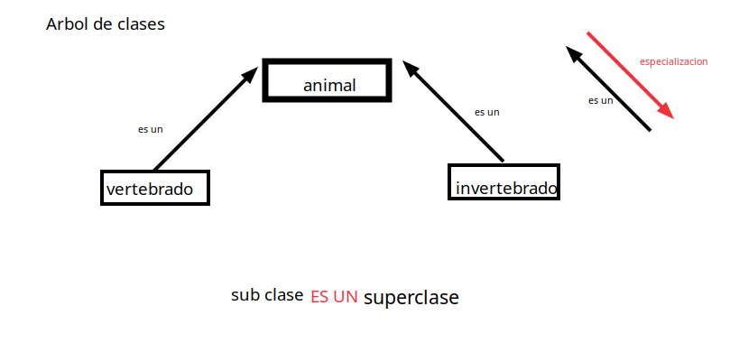
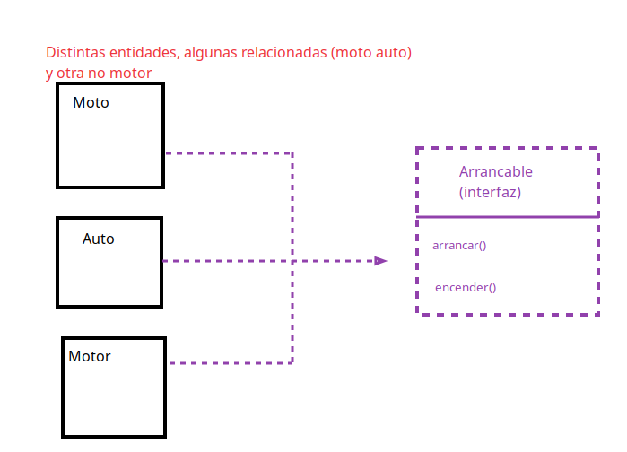

# Programacion orientada a objetos
---
> Bajo el paradigma orientado a objetos, todo programa es una **simulacion**. Cada entidad que se esta simulando
> esta representada en el programa a traves de una entidad u **objeto** que se **asocia**  a una entidad fisica o
> conceptual. **Todos** los componentes de un sistema son objets

> Los objetos se comunican por medio de **mensajes** o solicitudes para que un objeto lleve a cabo una de sus **operaciones**
---

## Varianes de la POO

La creacion de los objetos se puede llevar a cabo mediante 2 mecanismos: El uso de prototipos y la clasificacion

-   Clasificacion: Existen **moldes abstractos** de entidades del dominio denominados **clases** que definen **comportamiento** y **forma**
o estructura de un conjunto de objetos. Cada objeto se crea o instancia a partir de estos moldes

-   Prototipado: Se construyen instancias **concretas** de un conjunto de objetos, llamadoas **prototipos** que actuan de representantes de dicho 
    conjunto. Los objetos se crean a partir de **CLONAR** estos prototipos y luego modificarlos


## Porque POO? o cuandddo?

A la hora de enfrentar problemas de **dominio grande** y complejo nos facilita el poder modelar el problema , el diseño y diagramado generalmente
consta de **descubrir** las entidades y pensar sus **responsabilidades**

Reduccion de la brecha entre el mundo del problema y el mundo de los modelos: La OO intenta crear una **correspondencia** univoca entre
elemtos del **espacio del problema** y elementos en el **espacio de la solucion** => desde la perspectiva del paradigma orientado a objetos
los objetos de un programa interactuan y se comunican entre si para solucionar un problema

> Para realizar una buena POO hay que desarrollar todo el sistema utilizando el paradigma empezando desde el analisis y diseño


## Objetos
Un objeto es una entidad real o abstracta de la que tenemos datos y tiene metodos que controlan o manipulan esos datos u 
un objecto tiene **identidad** **estado** y **comportamiento**

## Clase 
Una clase es una nocion compartida para un conjunto de objetos, es un **Concepto** que se aplica a determinados objetos, Estos comparten estructura
y comportamiento . Una clase puede no poseer instancias pero no puede haber objeto(instancia) sin una clase a la que pertenezca.

## Refuerzos en aspectos de calidad de software

-   Modularidad: El desarrollo orientado a objetos refuerza o incentiva la modularizacion, la implementacion de cada objeto queda en su modulo

-   Reusabilidad: Una vez definida la interfaz de un objeto es facil reutilizarla sin repetir codigo

-   Extensibilidad: Es posible seguir agregando funcionalidad extendiendo clases e interfaces
-   Mantenibilidad: El aumento de la modularidad y la reusibilidad hace el codigo mas mantenible, mas facil de depurar, testear etc


## Pilares de la POO

| **Encapsulamiento**                                      | Abstraccion                                | Herencia                                                 | Polimorfismo                                |
|------------------------------------------------------|--------------------------------------------|----------------------------------------------------------|---------------------------------------------|
| un objeto solo expone lo que su **interfaz** permite | Entender el **que** y no tanto el **como** | Las entidades pueden heredar atributos y comportamientos | Las entidades pueden tener multiples formas |     

### Encapsulamiento

Meter los **atributos** y los **metodos** que manipulan los atributos en una estructura, y ocultar lo que queramos
entonces la conjuncion de abstraccion y ocultamiento de implementacion es el encapsulamiento: En los POO tenemos las clases para encapsular
y para ocultar tenemos la visibilidad, para exponer o no lo que queramos (public, private etc.)


**Atributos conceptuales(Propiedades)**: Es todo aquello que un usuario puede presumir que debe existir como atributo
aun cuando no exista explicitamente. Ejemplo: Angulo o modulo en un complejo

**Tipos especiales de atributos**:
  - Atributo de clase: Le pertenece a la clase no a la instancia, ejemplo: el color de todas las ventanas de una gui (static en java) los metodos de clase cambian los atributos de clase.
  - Atributo constante: Atributo que no cambia, bien puede ser de clase o de instancia. Ejemplo:nro de cliente(de instancia)
  - Atributo con restricciones: Es un atributo que depende de otros, ejemplo:edad que se calcule por fecha de nacimiento
    las restricciones que suelen tener estos atributos se denominan tambien invariantes.

  **Metodos**:Metodos de clase o de instancia
    -   Metodo de clase: Un metodo de clase es un metodo que no puede acceder a atributos de instancia y del cual existe una sola
        version posible (static se declaran en java). En POO pura no se utilizan variables o funciones que no sean metodos.
        Se utilizan metodos de clase cuando queremos usar poo pura pero a la vez se desea llamar a funciones sin usar un objeto
        entonces metemos la funcion como metodo de clase, (si tenes mucho metodos de clase seguramente estas haciendo mal poo)
  ```java
  public class Ventana {
    private static int color = 0xff0000;
    private int width;
    private int height;
  
    public Ventana(int width, int height){
        this.width = width;
        this.height = height;
    }
  
  public static void cambiarColor(int color){
    this.color = color; // this??? porque es de clase el atributo....
    }
  
  }
   ```

**Constructores**: Los constructors son metodos especiales para setear los atributos de los objetos (inicializacion)

**Destructores** liberan memoria y etc. depende del lenguaje

---
### Abstraccion

Diseño que esconde detalles de como se hace algo miemtras a su vez permite a los **usuarios** acceder a su funcionalidad
  (el **que hace**)
- Las abstracciones **no son unicas**, puede haber distintos niveles de abstraccion segun el nivel de conocimiento de los usuarios:
  No todos los usuarios conciben la misma abstraccion. En cuanto mas conocimiento tenga el usuario de la abstraccion menos abstracta sera o menos ocultamiento

    Niveles de abstraccion 

    | High level api (Usuario)    |
    |-----------------------------|
    | Abstraccion                 |
    | Intermediate APi(Tecnico)   |
    | Abstraccion                 |
    | Low level logic (Ingeniero) |

---
### Herencia

 La herencia es un tipo de **reutilizacion** propia de el POO (Tambien puede haber reutulizacion por composicion, agregacion)
    Cada clase puede tener una clase ancestro y clases descendientes y tambien gracias a ellas puede heredar atrinutos y comportamientos de su
    clase ancestro. Tambein puedo agregarle modificaciones entonces tengo extension



**Herencia multiple**: Herencia multiple es cuando tenes una clase que hereda de màs de una clase, tiene mas de un padre.
Cardozo:**Huì** de la herencia multiple, podemos caer en herencia multiple cuando cometemos u error conceptual, siempre 
las clasificaciones **deben ser EXCLUYENTES** A && B = VACIO

**Especializacion con menos atributos**:(Ver ejemplo de elipse r1, r2 y circulo como especializacion de)
  La unica forma de representar una sub-clase con menos atributos que su ancestro es hacer que ningun metodo acceda
  a esos atributos, haciendo privado los metodos o sobrescribirlos


**Constructores, destructores, herencia y composicion**:
Para asegurarse de que la inicializacion y construccion de un objeto se realice correctamente es importante en la llamada
al constructor de una clase **llamar al constructor de la clase ancestro inmediata**. En java se hace automaticamente, a menos
que la clase ancestro tenga varios o requiera parametros, en ese caso se requiere llamarlo explicitamente.


**Interfaces**: 
Es una coleccion de operaciones que espedcifican un servicio(su declaracion) que las clases que quieren implementar esa interfaz deben implementar 
Sirven para encapsular un conjunto de metodos sin asignar esta funcionalidad a ninguna clase en particular, ni expresar nada
respecto a como se implementa el codigo (Nomas su prototipo o firma)

> Una interfaz especifica un contrato que permite que permite que cambien client eo provedor en la medida que cada uno cumpla
> lo especificado por el conrato sin afectar todo lo demas

``` java
//declaracion de la interfaz
public interface Atacable {
public void recibirDaño(double daño); //recibe el daño a recibir..
}
```

``` java
//Implementacion de la clase que implementa interfaz Atacable
public class Arquero implements Atacable{
    private int cantidadDeFlechas;
    private int vida;
    
    public Arquero(int cantidadFlechas){
        this.cantidadDeFlechas = cantidadFlechas;
        this.vida = 100;
    }
    
    public void recibirDaño(double daño) { //implementacion del metodo de la interfaz ATACABLE
        this.vida -= daño; // Mejor hacer otra que quede en 0 si se pase y cambie estado a MUerto
    }
 }
```
-  Una interfaz puede tener interfaces descendientes (jerarquia de interfaces)
-  Una clase puede implementar multiples interfaces
- Los nombres de las interfaces por convencion suelen ser **adjetivos** ejemplo: runnable,throwable, comparable vogestible

---

### Polimorfismo: Multiples formas

> En _software_ se conoce como **polimorfismo**  a el brindar **una unica interfaz de interaccion para multiples entidades**
> que quizas no estaban relacionadas pero con esa interfaz adoptan una forma en comun


(Polimorfismo por interfaz)

```java
    //Este es un tipo de polimorfismo por INTERFAZ (no es el unico!)
    Moto moto = new Moto();
    Auto auto = new Auto();
    Motor motor = new Motor();
    //Todos los objetos entienden el message
    auto.arrancar();
    motor.arrancar();
    moto.arrancar();
```

### Existen distintos tipos de Poliformismo 4:

-   1- Polimorfismo ad hoc o por sobrecarga:Cuando el mensaje enviado (funcion invocada) contiene ambigüedad
    por referirse a operaciones con el mismo nombre pero el resultado difiere segun la forma de invocacion
    por el parametro recibido o por el retorno. La resolucion se hace en tiempo de **compilacion**


```java
public class Celular {
public agregar(Contacto c) {//implementacion}
public agregar(Aplicacion a) {//implementacion}

}

Celular celular = new Celular();
Contacto paula = new Contacto("Paula Cunha, "+5544249284");
Aplicacion whatsapp = new Aplicacion(permisos,"iconWhatsapp.png");
celular.agregar(whatsapp);
celular.agregar(paula);//mismo nombre distinta funcion
```

-   2- Polimorfismo Parametrico [generics y templates]: Permite escribir **genericamente** metodos o estructuras para que cuando se desee
    invocarlos o instanciarlos con distintos tipos de datos se instancie **particularmente** para ese tipo de dato


```java
    funcSort[T any](List[T],bool) List[T] //go? no se pero escribis la funcion generica y despues te sirve para ordenar todo 
```

-   3- Polimorfismo por subtipado(herencia) o interfaces: Si 2 clases heredan de una misma superclase entonces tienen la misma interffaz
    Entienden los mismos mensajes: Tenemos polimorfismo por interfza y por subtipado

Las interfaces **formalizan** el polimorfismo ya que permiten definir polimorfismo de una forma declarativa sin detalles de implementacion

> Un grupo de entidades son polimorficas respecto a una interfaz. Las interfaces facilitan el polimorfismo en la poo, ya que permitem
> que la arquitectura sea **plug and play** donde es facil remplazar una clase por otra sin mayor repercusion ya que implementan
> la misma interfaz


> Si la clase A implementa lan interfaz C entonces puedo tratarla como una instancia de C


```java
    Moto moto = new Moto();
    Auto auto = new Auto();
    Motor motor = new Motor();
    //Todos los objetos entienden el message, entonces trabajo con ARRANCABLES, no con motores ni autos ni motos, plug and play
    
    Arrancable arrancable = auto;
    
    Gestor gestor =  new Gestor(arrancable);   

```

**Objeto polimorfo**: Un objeto que puede adoptar multiples formas, ejemplo: el Gestor recibe un **arrancable**
    que es un objeto polimorfo porqe puede ser un auto moto o motor

### Lo esencial del polimorfismo:


>Lo esencial del polimorfismo es que **rompe con la tipica vinculacion temprana** de los lenguajes compilados
> que vinculan en tiempo de compilacion la llamada a un subprograma con la direccion absoluta de este

---

### Clases abstracas(no instanciables)

Son clases que no admiten instancia: se utilizan para agrupar otras clases generalmente.
Se utilizan para declarar metodos y atributos comunes a las subclases
Pueden ser abstractas porque tienen metodos abstractos (a implementar por las subclases)
o bien por declararlas como tales

> Si tenes atributos comunes entonces considerar usar abstracas, sino interfaz


---
## Documentacion

> _Lo importante es la disponibilidad de la documentacion que se neceista en el momento en el que se la necesita
> . El mantenimiento tambien debe llegar a la documentacion. La documentacion para desarrolladores a menudo se denomina **modelo**_


Fases a documentar (todas)
-   Requerimientos
- Analisis
- Diseño
- Programacion
- Pruebas


> Importante: Al igual que si hicieramos un edificio necesitamos diferentes tipos de diagrama para los distintos tipos de usuarios


### Diagramas UML (Unified modeling languaje)

- Diagrama de clases: Relaciones entre clases e interfaces
- Diagrama de caso de uso:Representan funciones de un **sistema** desde el punto de vista del **usuario**
- Diagrama de secuencia: Son una representacion temporal de los **objetos** y sus interfaces
- Diagrama de flujo
- Diagrama de despliegue
- Diagrama de estados y transiciones